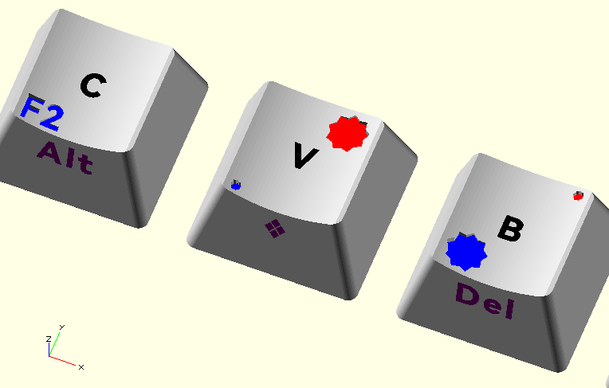
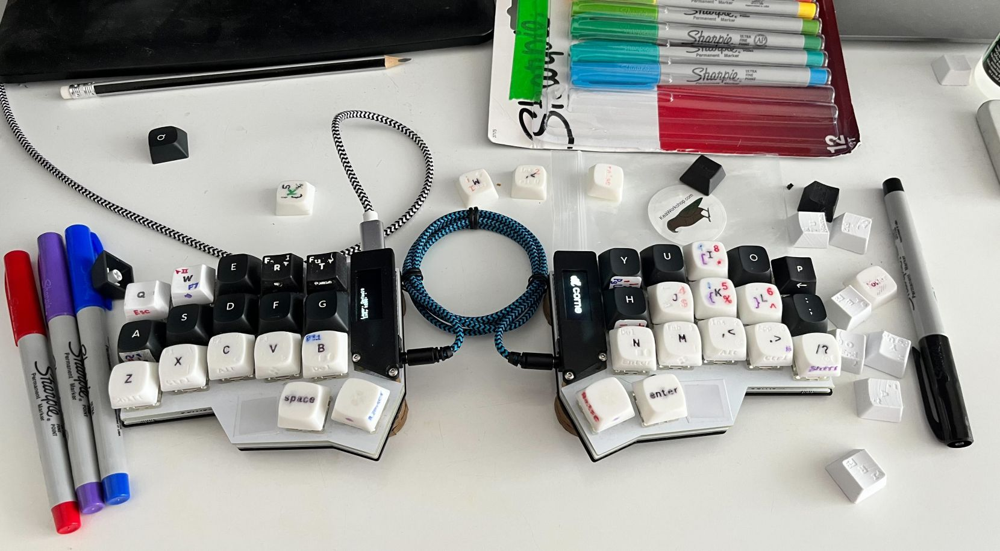
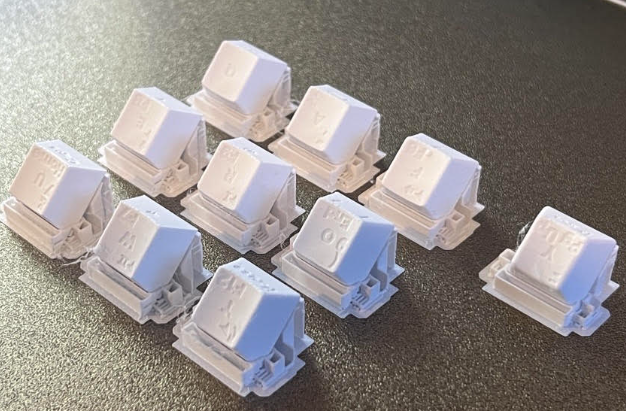
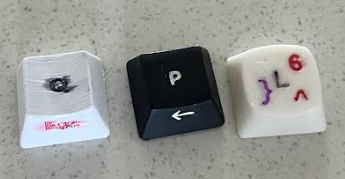
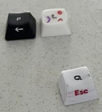
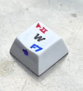

# Changelog

I'm trying to design keycaps which are good when printed on
3D printer with AMS or similar material changing system.

## 16 Mar 2025

After failure with JSCAD I decided to tidy up my OpenSCAD scripts. Upgraded to OpenSCAD-2025.03.12.

Even though JSCAD has less problems extruding SVG this does not mean it all rainbows and unicorns there.
One of the biggest reasons I wanted to switch to JSCAD was that it is not possible in OpenSCAD to measure
objects, for example it is not possible to get dimensions of newly imported SVGs, as well as it is not possible
to align them relatively. The only alignment available is "center" at import time.

Working around this limitation of OpenSCAD was somewhat easier than figuring out how extrusions work in JSCAD:
I simply created extra JS script which scans directory with SVG files, reads their box dimensions and then
writes them into scad file which can later be imported into scad script.

The alignment algorithm seems to be working well with SVGs of different sizes:  

!!! Idea !!! SVG file names should match QMK codes! Hypothetically I can later work out script to convert keymap.c to data for keycaps.scad

## 15 Mar 2025

OpenSCAD language feels a bit awkward for me, I had hopes to make it easier writing JavaScript with JSCAD (aka OPENJSCAD),
and it all looked good, until I tried to extrude my SVGs. So far JSCAD is really weak with extruding SVGs.
See https://github.com/jscad/OpenJSCAD.org/issues/1253, https://github.com/jscad/OpenJSCAD.org/issues/1087 and https://github.com/jscad/OpenJSCAD.org/issues/1386

## 7 Mar 2025

Looking at my old coloured keycaps I can conclude that permanent marker wears over time, acrylic paint seems to be in a good shape and automotive enamel not showing any detereoration at all.

## 3 Mar 2025

Decided that it's better to have every symbol in a separate file.
This will help me exporting for 3D printing (with separate file for each material).

## 26 Feb 2025

Moved keycaps from https://github.com/andruhon/34KeysLayoutQMK into this separate repo.

## 23 Feb 2025

Printed first keycaps on P1S with AMS with 0.2mm nozzle. They look really nice!
Concluded that keycaps are small enough and don't really need support if infill selected correctly.  

## 27 Nov 2024

A photograph of different prototypes on my keyboard

- P,T and R are from newcaps.scad - illed with automotive enamel and sanded.
- zxcvbnmjkli and thumb cluster are from keycap-edit-gui.scad painted with ultra fine point permanent markers. These caps currently have some advantage that they do not need to be sanded - they come smooth enough by themselves, because they are flat.
- Q and W are also from newcaps.scad, but painted with permanent marker. Q first painted and sanded, P first sanded then painted. It is important to notice that layer lines work as capillary and suck all the paint, so it is preferrable to sand the button first.
- Black keys except R,T and P are Keychron caps.

## 24 Nov 2024

It is getting hard to get in to the queue in the library, also they refuse to do any tinkering with settings printing everything on defaults. I decided to print a few keycaps for money in local worksop (it is not cheap).

Tried to colour new keycaps and found that because they were printed at an angle they have notable bleeding of permanent marker paint.
On the picture below L with 6 and arrow right is coloured with acrylic paint (except curly brace, which is a permanent marker);
P is sanded and coloured with automotive enamel;
Q with Esc is panted with permanent marker and has notable bleeding.  

Most of bleeding has came off from Q after sanding, but it seems like some of that has penetrated deeper:  

Sanded W with mouse 2 before painting, and no bleeding observed:  

## 20 Nov 2024

Started building my own profile with concave and cyllindric stems and extra print on front side. Unfortunately library have ran out of white filament, so I decided to print my new keycaps with concave in black. Black filament turned to be more fragile.
Tried colouring them with nail polish, acrylic paint and car enamel. Only P with backspace pinted with white automotive enamel survived.

## 26 Oct 2024

Had issues with stems on both Riskable and Aileron profiles. They either too loose, or too fragile. Not sure why Aileron keycaps have rectangular stem, so they cannot be placed on side.

## 22 Oct 2024

Ordered to print my keykaps in Makerspace of local library. It took 10 days to get to the tip of the queue and get my first prototypes. I started with flat keycaps from karlh592 (aileron.me).
The flat keycap was K with arrow down on lower, and 5 raise. I also printed a few blank keycaps from https://github.com/riskable/keycap_playground/, it seems like they are really optimized for FDM and feel good to touch.
I initially intended to print colour infill like described in https://aileron.me/app/keycap , but guys from library said that they have not capacity (in terms of quque length) to do multi-colour printing.
Aileron, keycaps also look really nice and I figured out that I can paint letter grooves with permanent markers or nail polish. While they are nice keycaps with concave are a lot better to type on.
